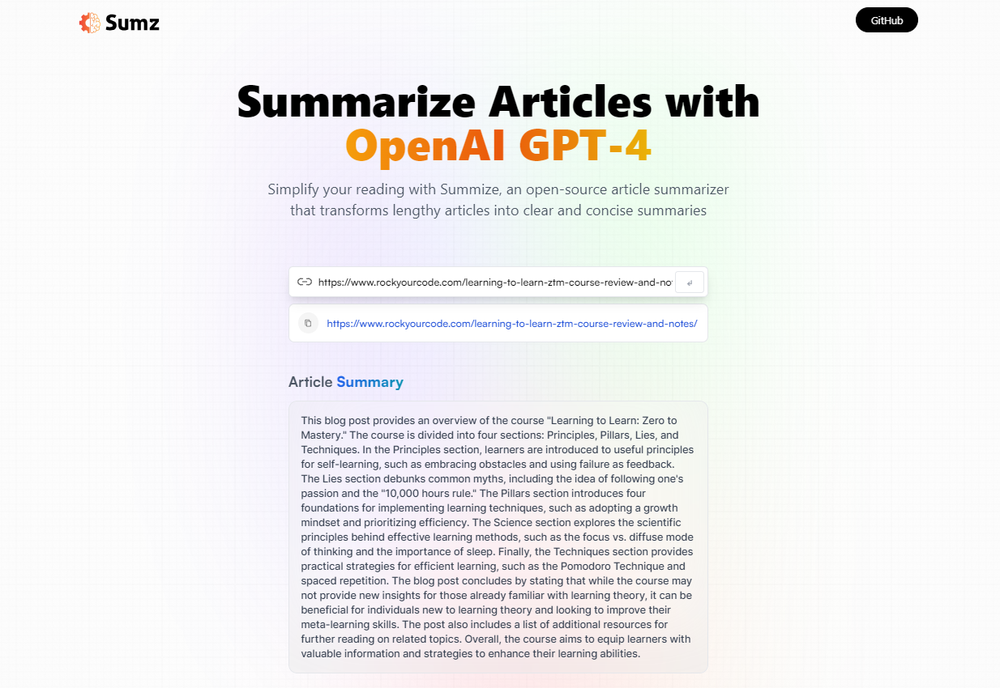

# Build a robust AI Summarizer Application using OpenAI's GPT model.

# Introduction
Sumz is an open-source article summarizer that transforms lengthy articles into clear and concise summaries using OpenAI's GPT model.

# Implementation
- setup a ReactJS project using Vite
- create a responsive, beautiful UI/UX with a nice touch of glass morphism using Tailwind CSS
- make advanced RTK query API requests that fire on condition
- save history using the local storage
- handle form events and catch errors
- implement copy to clipboard
- write clean code

 Learn from:
  ⭐ JSM Masterclass Experience - https://jsmastery.pro/masterclass

# React + Vite

This template provides a minimal setup to get React working in Vite with HMR and some ESLint rules.

Currently, two official plugins are available:

- [@vitejs/plugin-react](https://github.com/vitejs/vite-plugin-react/blob/main/packages/plugin-react/README.md) uses [Babel](https://babeljs.io/) for Fast Refresh
- [@vitejs/plugin-react-swc](https://github.com/vitejs/vite-plugin-react-swc) uses [SWC](https://swc.rs/) for Fast Refresh
